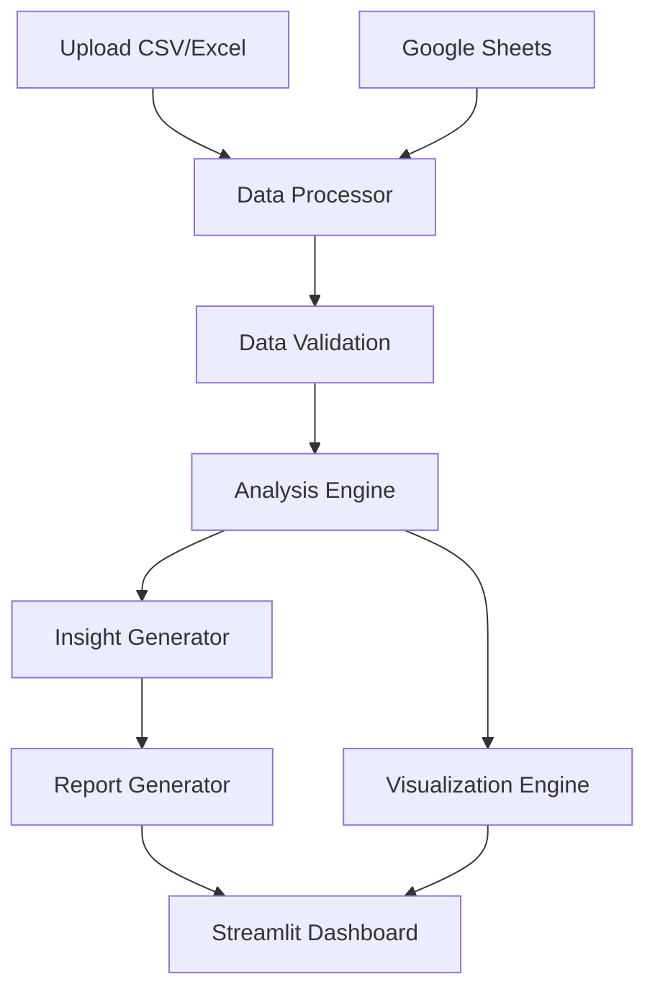

# Architecture Overview

## System Architecture

O Agente Marketing IA é construído com uma arquitetura modular e escalável:

### Frontend (Streamlit)
- **Framework**: Streamlit 1.49.1
- **Linguagem**: Python 3.12
- **Styling**: CSS customizado
- **Port**: 8501 (padrão)

### Backend (Python)
- **Framework**: Modular Python
- **Linguagem**: Python 3.12
- **Processamento**: Pandas, NumPy
- **Visualização**: Plotly, Matplotlib

### Infraestrutura de Desenvolvimento
- **Banco de Dados**: SQLite (desenvolvimento) → PostgreSQL (produção)
- **APIs**: Google Sheets API
- **Cache**: Em memória (Streamlit sessions)
- **Storage**: Sistema de arquivos local

### Estrutura Modular
```
src/
├── components/     # Componentes de interface reutilizáveis
├── services/       # Serviços de integração e processamento
└── hooks/          # Hooks customizados para lógica compartilhada

utils/              # Utilitários de processamento de dados
analysis/           # Módulos de análise e algoritmos
templates/          # Templates de relatórios e documentos
api/               # Integrações com APIs externas
```

## Key Design Decisions

1. **Streamlit para MVP**: Rapidez no desenvolvimento e facilidade de uso
2. **Arquitetura Modular**: Facilita manutenção e escalabilidade
3. **Python First**: Ecosistema rico para análise de dados e ML
4. **File-based Development**: Simplicidade inicial com migração planejada para BD

## Data Flow



## Scalability Considerations

### Current Limitations
- **Single User**: Sem autenticação multi-usuário
- **Memory Bound**: Processamento em memória
- **File Storage**: Sem persistência de dados
- **Monolithic**: Aplicação única

### Future Enhancements
- **Multi-tenant**: Suporte a múltiplas organizações
- **Database**: PostgreSQL para persistência
- **API Layer**: NestJS para backend robusto
- **Frontend**: Next.js para interface moderna

## Security Considerations

### Current Implementation
- **Environment Variables**: Credenciais em .env
- **Local Processing**: Dados processados localmente
- **No Authentication**: Acesso livre

### Planned Security
- **JWT Authentication**: Autenticação baseada em tokens
- **Data Encryption**: Criptografia de dados sensíveis
- **LGPD Compliance**: Conformidade com privacidade
- **Audit Logging**: Logs de todas as operações

## Performance Optimization

### Current Performance
- **Memory Efficient**: Pandas otimizado
- **Lazy Loading**: Carregamento sob demanda
- **Caching**: Cache de sessão Streamlit

### Future Optimization
- **Database Indexing**: Índices otimizados
- **CDN**: Distribuição de conteúdo
- **Load Balancing**: Balanceamento de carga
- **Microservices**: Serviços especializados

## Monitoring and Observability

### Current Monitoring
- **Streamlit Logs**: Logs básicos da aplicação
- **Error Handling**: Tratamento de exceções

### Planned Monitoring
- **Application Logs**: Logging estruturado
- **Performance Metrics**: Métricas de performance
- **Health Checks**: Verificações de saúde
- **Error Tracking**: Rastreamento de erros

## Technology Evolution Path

### Phase 1: Current (Streamlit MVP)
```
Frontend: Streamlit
Backend: Python Modules
Database: File System
Deployment: Local
```

### Phase 2: API Integration
```
Frontend: Streamlit (Enhanced)
Backend: Python + FastAPI
Database: PostgreSQL
Deployment: Cloud
```

### Phase 3: Modern Stack
```
Frontend: Next.js
Backend: NestJS
Database: PostgreSQL + Redis
Deployment: Container + K8s
```