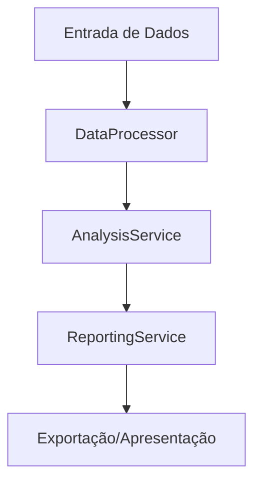

# Organização de Pastas do Agente Marketing

## Estrutura Principal

- `src/components`: Componentes de interface reutilizáveis (Streamlit widgets, visualizações)
- `src/services`: Serviços de integração e processamento de dados
- `src/hooks`: Hooks customizados para lógica compartilhada
- `utils/`: Utilitários de processamento de dados (mantido da versão atual)
- `analysis/`: Módulos de análise e algoritmos (mantido da versão atual)
- `templates/`: Templates de relatórios e documentos (mantido da versão atual)
- `api/`: Integrações com APIs externas (mantido da versão atual)

## Padrões Recomendados

### Nomenclatura
- **Componentes**: PascalCase (ex: `DataUploader.py`, `ChartRenderer.py`)
- **Serviços**: camelCase (ex: `dataProcessor.py`, `reportGenerator.py`)
- **Utilitários**: snake_case (ex: `data_cleaner.py`, `file_handler.py`)

### Organização por Domínio
- **services/data/**: Serviços relacionados a dados
- **services/analysis/**: Serviços de análise
- **services/reporting/**: Serviços de relatórios
- **components/widgets/**: Componentes de interface
- **components/charts/**: Componentes de visualização

### Exemplo de Estrutura Detalhada

```
src/
├── components/
│   ├── widgets/
│   │   ├── DataUploader.py
│   │   ├── FileSelector.py
│   │   └── ProgressBar.py
│   ├── charts/
│   │   ├── BarChart.py
│   │   ├── LineChart.py
│   │   └── PieChart.py
│   └── layout/
│       ├── Sidebar.py
│       ├── Header.py
│       └── Footer.py
├── services/
│   ├── data/
│   │   ├── dataProcessor.py
│   │   ├── dataValidator.py
│   │   └── dataExporter.py
│   ├── analysis/
│   │   ├── statisticalAnalysis.py
│   │   ├── personaGenerator.py
│   │   └── insightEngine.py
│   └── reporting/
│       ├── reportGenerator.py
│       ├── templateEngine.py
│       └── exportService.py
└── hooks/
    ├── useData.py
    ├── useAnalysis.py
    └── useReports.py
```

## Migração da Estrutura Atual

### Mantidos (Legacy)
- `utils/data_processor.py` → Mantido para compatibilidade
- `analysis/basic_analysis.py` → Mantido para compatibilidade
- `templates/report_generator.py` → Mantido para compatibilidade
- `api/google_sheets.py` → Mantido para compatibilidade

### Novos (Modern Structure)
- `src/services/data/dataProcessor.py` → Versão moderna do utils
- `src/services/analysis/statisticalAnalysis.py` → Versão moderna do analysis
- `src/services/reporting/reportGenerator.py` → Versão moderna do templates
- `src/services/external/googleSheetsService.py` → Versão moderna do api

## Diretrizes de Implementação

1. **Compatibilidade**: Manter imports antigos funcionando
2. **Gradualidade**: Migrar módulos um por vez
3. **Documentação**: Cada módulo deve ter docstrings claras
4. **Testes**: Implementar testes para novos módulos
5. **Type Hints**: Usar type hints em todos os novos módulos

## Evolução Futura

Quando migrarmos para Next.js/NestJS, esta estrutura facilitará:
- **Components** → React Components (Next.js)
- **Services** → Injectable Services (NestJS)
- **Hooks** → React Hooks (Next.js)

> Para detalhes sobre a migração, consulte o roadmap de evolução tecnológica em `/docs/architecture/overview.md`.

## Fluxos Reais do Código Migrado

### Exemplo: Fluxo de Processamento e Geração de Relatório



- **DataProcessor**: Limpa e valida os dados recebidos do cliente.
- **AnalysisService**: Realiza análise estatística, gera insights e recomendações.
- **ReportingService**: Gera relatórios executivos, propostas e apresentações.
- **Exportação/Apresentação**: Exporta para PDF, Google Sheets ou apresenta via Streamlit.

### Integração Entre Serviços

```python
from services.data.data_processor import DataProcessor
from services.analysis.analysis_service import AnalysisService
from services.reporting.reporting_service import ReportingService
import pandas as pd

df = pd.read_csv('dados.csv')

# Processamento
processor = DataProcessor(df)
dados_limpos = processor.clean_data()

# Análise
analysis = AnalysisService(dados_limpos)
insights = analysis.run_full_analysis()

# Relatório
reporting = ReportingService(dados_limpos)
relatorio = reporting.generate_full_report()
print(relatorio)
```

### Testes Automatizados

- Todos os serviços possuem testes unitários em `src/tests/`
- Fluxos de integração testados em `test_integration_data_flow.py`

---